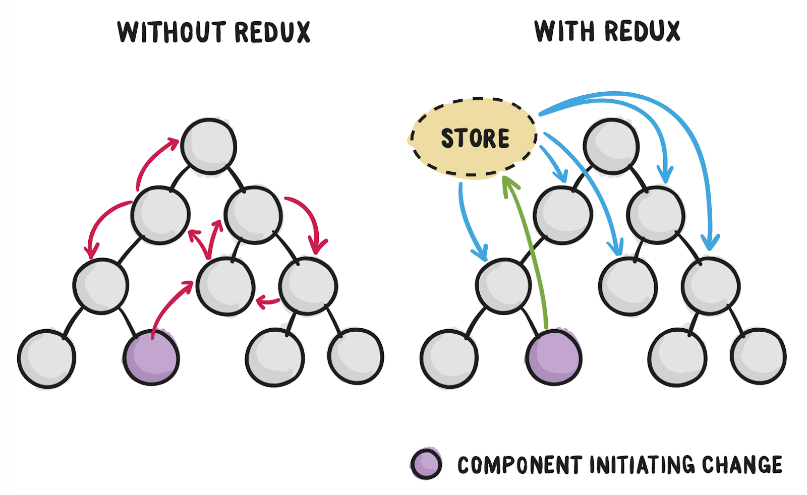
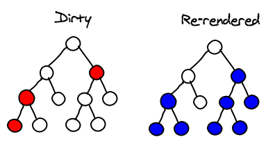
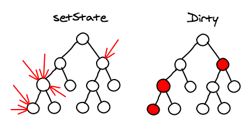
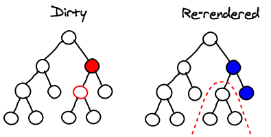

<!--
Put aside
Imported from google slide, but not used in reveal version, for now
-->

##==##

<!-- .slide:-->

# FLUX - Redux

##==##

<!-- .slide:-->

FLUX


##==##

<!-- .slide:-->

redux

reducer = pure function

(currentState, action) => newState

action = plain object

{ type: string
…other properties
}

##==##

<!-- .slide: class="with-code" -->

redux

```

store

{
dispatch(action) => void
  	getState() => state
	subscribe(() => void) => (() => void)
}


```

##==##

<!-- .slide:-->

# React + Redux

##==##

<!-- .slide:-->

react-redux



##==##

<!-- .slide:-->

connect ...

##==##

<!-- .slide:-->

mapStateToProps:
(state, ownProps) => propsFromState

mapDispatchToProps:
(dispatch, ownProps) => handler

connect(mapStateToProps, mapDispatchToProps) => higher order component

connect

##==##

<!-- .slide:-->

Exercice 10 : add redux

10

separate your state and react

Write reducer in state.js to handle actions that update people and person

Write connectors in connect.js for :
One for people state (and an action to load people)
One for loading state
One to find a person in people state
(and an action to update a specific person into people statte

##==##

<!-- .slide:-->

Exercice 11 : encapsulate redux

11

a public interface for your state

Normalize people state (should be an object containing “map” and “all”)

Add “query” in state to handle filtered people in SearchableList

Implement new connectors in connect.js=> And Use them to connect components who might need them

##==##

<!-- .slide:-->

Exercice 12 : embrace redux

12

everything is connected

Add “current” in state to handle state of Carousel in redux

And Create connectors

##==##

<!-- .slide:-->

Exercice 13 : redux all the things

13

more than just state - your business layer

##==##

<!-- .slide:-->

# Thank you

# #sfeirschool #react

@sfeir @wgoedel goedel.w@sfeir.com


##==##

<!-- .slide:-->

##==##

<!-- .slide:-->

# higher order components

recompose

##==##

<!-- .slide:-->

# a word on performance

##==##

<!-- .slide:-->

rappel...





Notes:
async setState - batch update

##==##

<!-- .slide:-->

memo / shouldComponentUpdate



Notes:
ex: write simple function addadd null/NaN checksex: check params for NaN/null -> return NaNtest with multshow util with Math.min (0 if null)

##==##

<!-- .slide:-->

memo / shouldComponentUpdate

demo

Notes:
track render

##==##

<!-- .slide:-->

# a bit about functions

##==##

<!-- .slide: class="with-code" -->

composition

```
f :: a -> b
g :: b -> c

(g . f) (x) = g(f(x))
h = (g . f)

h :: a -> c

```

##==##

<!-- .slide: class="with-code" -->

composition

```
two HOCs:

hoc1 :: c1 -> c2
hoc2 :: c2 -> c3

compose(hoc2, hoc1) :: c1 -> c3

```

##==##

<!-- .slide: class="with-code" -->

partial application

```
signature of an HOC:
c1 -> c2

to build an HOC:
hocFactory :: conf -> c1 -> c2

hoc = hocFactory (conf)


```

##==##

<!-- .slide: class="with-code" -->

re-compose

```

https://github.com/acdlite/recompose


```

##==##

<!-- .slide:-->

# Tests !!!

##==##

<!-- .slide:-->

JEST


##==##

<!-- .slide:-->

JEST

executes in NodeJS directly
parallel execution
does not require bundling (webpack not involved)
can be used with Babel or TypeScript

jsdom
jasmine matchers
jest spies / mocks
nyc coverage (lcov)
