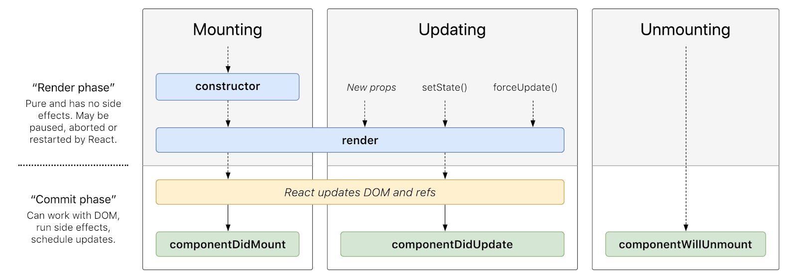
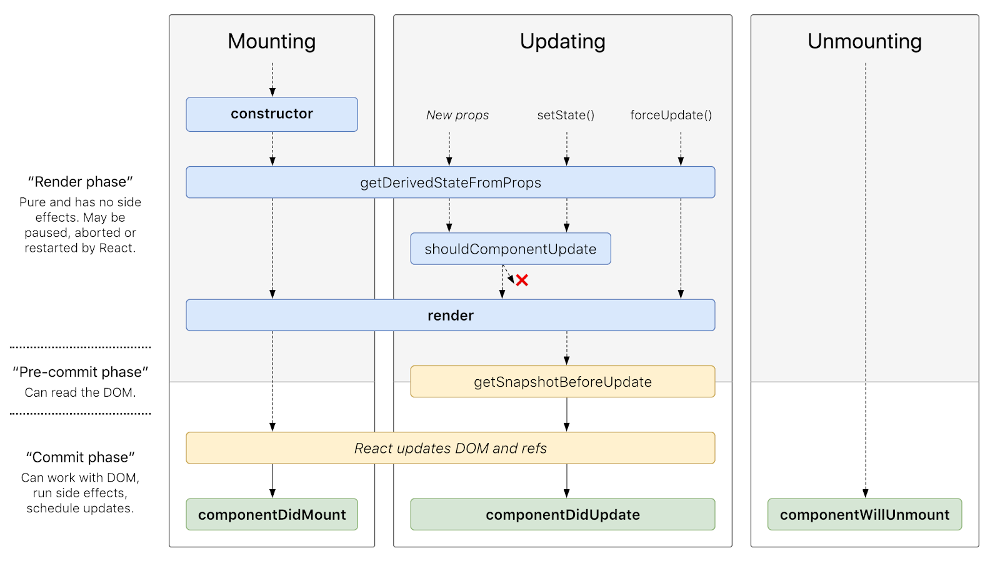

##==##
<!-- .slide:-->

handling events


Event handlers are just properties

Event arguments take the opposite direction of properties


app state


todos, filter


filter


todo


onFilterChange(...)


onTodoDone(todo)


onTodoDone(todo)


Notes:
use events.jsx


##==##
<!-- .slide:-->

ONE MORE THING...


##==##
<!-- .slide:-->


Hooks


##==##
<!-- .slide:-->

hooks


from the docs:

Hooks are a new feature that lets you use state and other React features without writing a class

Classes confuse both people and machines

There are no plans to remove classes from React.

Hooks don’t replace your knowledge of React concepts. Instead, Hooks provide a more direct API to the React concepts you already know: props, state, context, refs, and lifecycle. As we will show later, Hooks also offer a new powerful way to combine them.


Notes:
use events.jsx


##==##
<!-- .slide:-->

hooks


demo 02 bis


Notes:
show setState with a function

explain async nature of setState


##==##
<!-- .slide:-->

Exercise 03 bis: useState hook


back to functions


3


change the PersonCarousel back into a function component

use useState to keep track of the current index

keep the projection function
setState :: oldState => newState
it is returned by the range util


Notes:
LIVE CODING


##==##
<!-- .slide:-->

SOLUTION...


##==##
<!-- .slide:-->

# conditionals, lists
and more about children


##==##
<!-- .slide: class="with-code" -->


```
const Welcome = ({ username }) => (
  <h1>Welcome back, {username}</h1>
);

const Login = ({ onLogin }) => (
  <h1>Please <button onClick={onLogin}>login</button></h1>
);

const Header = ({ username, login }) => {
  if (username) {
    return <Welcome username={username} />;
  } else {
    return <Login onLogin={login} />;
  }
}

```

use
if-then-else
or
switch


conditionals


Notes:
use events.jsx


##==##
<!-- .slide: class="with-code" -->


```
const Header = ({ username, login }) => {
  let welcome;
  if (username) {
    welcome = <Welcome username={username} />;
  } else {
    welcome = <Login onLogin={login} />;
  }

  return (
    <header>
      
      {welcome}
    </header>
  );
}

```

or a
variable


conditionals


Notes:
use events.jsx


##==##
<!-- .slide: class="with-code" -->


```


const Inbox = ({ messages, unread }) => (
  <div>
    {unread.length > 0 &&
      <header>You have {unread.length} unread messages</header>
    }
    <main>
      {messages}
    </main>
  </div>
);

```

or a
logical operator

React ignores false and null


conditionals


Notes:
use events.jsx


##==##
<!-- .slide: class="with-code" -->


```

const Inbox = ({ messages, unread }) => (
  <div>
    {unread.length > 0 ? (
      <header>You have {unread.length} unread messages</header>
    ) : (
      <header>Nothing new for now</header>
    )}
    <main>
      {messages}
    </main>
  </div>
);

```

or the
ternary operator
(it's an expression!)


conditionals


Notes:
use events.jsx


##==##
<!-- .slide:-->

conditionals


Surprise !

they are just JavaScript expressions


No ng-if, v-if, *ngIf or {{#if…}} to remember


Notes:
use events.jsx


##==##
<!-- .slide: class="with-code" -->


same for lists

JSX accepts arrays of elements

the rest is
(functional)
JavaScript


```

const Inbox = ({ messages, unread }) => (
  <div>
    {unread.length > 0 &&
      <header>{unread.length} unread</header>
    }
    <main>
      {messages.map(message => (
        <Message {...message} />
      ))}
    </main>
  </div>
);


```

lists


Notes:
use events.jsx


##==##
<!-- .slide: class="with-code" -->


...but


```


Warning: Each child in an array or iterator should have a unique "key" prop. Check the render method of `Inbox`. See https://fb.me/react-warning-keys for more information.


```

lists


Notes:
use events.jsx


##==##
<!-- .slide:-->


lists


Notes:
use events.jsx


##==##
<!-- .slide: class="with-code" -->

lists


always add the pseudo-prop "key" when inserting element arrays

key must be unique in the context of the list only

key should derive from the displayed entity(the index is useless - why?)


```

const Inbox = ({ messages, unread }) => (
  <div>
    {unread.length > 0 &&
      <header>{unread.length} unread</header>
    }
    <main>
      {messages.map(message => (
        <Message {...message} key={message.id} />
      ))}
    </main>
  </div>
);


```

Notes:
une exception → children


##==##
<!-- .slide: class="with-code" -->


```
const Tabs = ({ children }) => {
  const [current, setCurrent] = useState(0);
  return (
    <section>
      <header>
        {React.Children.map(children, (child, i) => (
          <Tab
            title={child.props.title}
            onSelect={() => setCurrent(i)} />
        ))}
      </header>
      <main>
        {React.Children.toArray(children)[current]}
      </main>
    </section>
  );
};


```

children


children property is an opaque structure

React.Children utility can be used to traverse the children "collection"

use React.cloneElement if you need to add properties


##==##
<!-- .slide:-->

Exercise 04: lists of persons


4


Change App so you can switch between a List and a Carousel of PersonCards
use the action item in Header to toggle the views
sure, this is normally done with a router… patience…

Create the Carousel component displaying anything you pass as children
there must not remain any reference to PersonCard


repeat yourself


##==##
<!-- .slide:-->

SOLUTION...


##==##
<!-- .slide:-->

# ...recap


##==##
<!-- .slide:-->

React is...


a library to manage the vue
component oriented
UI = f(state)

a simple API (no DSL)
a functional approach to WEB development
just JavaScript


Notes:
use events.jsx


##==##
<!-- .slide:-->


# This was just the beginning ...


# #sfeirschool #react
@sfeir @wgoedel


##==##
<!-- .slide:-->


# This was just the beginning ...


# #sfeirschool #react
@sfeir @wgoedel


##==##
<!-- .slide:-->

# input,
controlled components


##==##
<!-- .slide:-->

demo 03


Controlled components


##==##
<!-- .slide:-->

input - controlled components


state = { value, disabled, … }


state = { value, disabled, … }


Notes:
use events.jsx


##==##
<!-- .slide:-->


sync


state = { value, disabled, … }


state = { value, disabled, … }


input - controlled components


Notes:
use events.jsx


##==##
<!-- .slide:-->


Every piece of knowledge must have a single, unambiguous, authoritative representation within a system
the DRY principle
The Pragmatic Programmer (Andy Hunt, Dave Thomas)


sync


state = { value, disabled, … }


state = { value, disabled, … }


input - controlled components


Notes:
use events.jsx


##==##
<!-- .slide:-->


value, disabled, ...


onChange, ...


component is thesingle source of truth


state = { value, disabled, … }


state = { value, disabled, … }


projection of state


input - controlled components


Notes:
use events.jsx


##==##
<!-- .slide:-->


a word about refs


parent components interact with their children via props
to modify a child, re-render with new props;that's the typical state projection UI = f(state)

sometimes you need to imperatively modify a component outside the typical dataflow
focus() a DOM component, play() a <video>
interact with WebComponents

refs are escape hatcheshttps://reactjs.org/docs/refs-and-the-dom.html


##==##
<!-- .slide: class="with-code" -->


```
class Jukebox extends React.Component {
  audioElmt = React.createRef();

  play() {
    this.audioElmt.current.play();
  }

  render() {
    return <audio ref={this.audioElmt} />;
  }
}


const MyInput = props => {
  const inputRef = useRef();

  execWhenItAppears(() => {
    inputRef.current.focus();
  });

  return <input ref={inputRef} {...props} />;
};


```

refs


refs of DOM components give access to the document object instance - this includes WebComponents

refs of class components give access to their exposed API

you can't ref a function component


##==##
<!-- .slide:-->

Exercice 05: inputs and refs


5


Implement the SearchableList component
manage a query state holding the value of the search input
display the filtered list on change
connect the clear icon

Expose an imperative next method on the Carousel in Player
call it via a ref when the play button is clicked


filter lists, control the carousel


##==##
<!-- .slide:-->

SOLUTION...


##==##
<!-- .slide:-->

# lifecycle and effects


##==##
<!-- .slide:-->


component lifecycle


http://projects.wojtekmaj.pl/react-lifecycle-methods-diagram/




##==##
<!-- .slide:-->


component lifecycle




##==##
<!-- .slide:-->


...but
what about hooks?


##==##
<!-- .slide: class="with-code"  class="with-code" -->


useEffect hook


```

const FromServer = () => {
  useEffect(() => {
    load().then(setData);
  }, []);

  return <Something />;
};

```

```

class FromServer extends React.Component {
  async componentDidMount() {
    const data = await load();
    this.setState({ data });
  }

  render() {
    return <Something />;
  }
}


```

##==##
<!-- .slide: class="with-code"  class="with-code" -->


useEffect hook


```

const FromServer = () => {
  useEffect(() => {
    let set = true;
    load().then(data => {
      if (set) setData(data);
    });
    return () => set = false;
  }, []);

  return <Something />;
};

```

```

class FromServer extends React.Component {
  async componentDidMount() {
    this.setData = true;
    const data = await load();
    if (this.setData === true) {
      this.setState({ data });
    }
  }

  componentWillUnmount() {
    this.setData = false;
  }

  render() {
    return <Something />;
  }
}

```

##==##
<!-- .slide: class="with-code"  class="with-code" -->


useEffect hook


```

const Repeat = () => {
  useEffect(() => {
    const timeoutId = setTimeout(
      () => repeatSomething(),
      100
    );

    return () => clearTimeout(timeoutId);
  });

  return <Something />;
};

```

```

class Repeat extends React.Component {
  componentDidMount() {
    this.intervalId = setInterval(
      () => this.repeatSomething(),
      100
    );
  }

  componentWillUnmount() {
    clearInterval(this.intervalId);
  }

  render() { return <Something />; }
}

```

##==##
<!-- .slide:-->


how to avoid refs?


##==##
<!-- .slide:-->

Exercice 06: lifecycle


6


Contact the API - load people from 'http://localhost:3000/people'
use the loadPeople function in utils

implement the play button in Player, show the next person every two seconds
lift state up into the player - make Carousel "controlled"
how will you stop the timeout function ?
there must not be any warning when switching back to list


have some side effects


##==##
<!-- .slide:-->

SOLUTION...


##==##
<!-- .slide:-->

# about states


##==##
<!-- .slide:-->

sharing state


in a component architecture, state must be shared at the nearest common ancestor of components using the same state

...this can be quite far away ?


Notes:
use events.jsx


##==##
<!-- .slide:-->

transient UI state


local state of a visual component, with no link to business data


Notes:
use events.jsx


##==##
<!-- .slide:-->

navigation state


state of the URL

"window" you are looking through at your application

easily sharable by just copy/pasting


Notes:
use events.jsx


##==##
<!-- .slide:-->

application state


your application's business data


Notes:
use events.jsx


##==##
<!-- .slide:-->

persistent state


basically data managed by the server


Notes:
use events.jsx
